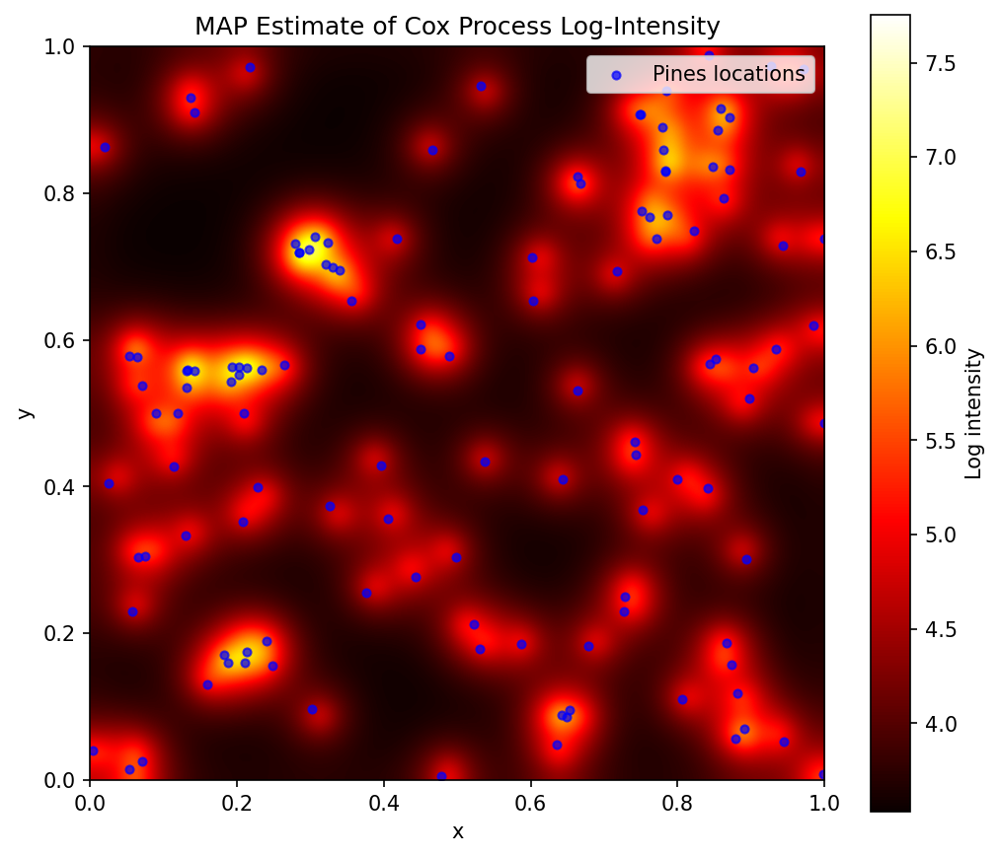

# Distributions

This page describes each distribution in `jax-pdf`, including the mathematical definition, parameters, and typical use cases.

## Banana2D

A banana-shaped 2D distribution commonly used as an MCMC benchmark.

**Mathematical definition:**

$$
p(x_0, x_1) = \mathcal{N}(x_0; 1, 1) \cdot \mathcal{N}(x_1; x_0^2, \sigma^2)
$$

The distribution is centered around the parabola $x_1 = x_0^2$, creating a curved shape that challenges gradient-based samplers.

**Parameters:**

| Parameter | Default | Description |
|-----------|---------|-------------|
| `sigma` | 0.1 | Controls the thickness of the banana. Smaller values create thinner, more challenging distributions. |

**Example:**

```python
from jax_pdf import Banana2D
import jax

banana = Banana2D(sigma=0.1)

# Thin banana (harder to sample)
thin = Banana2D(sigma=0.01)

# Fat banana (easier)
fat = Banana2D(sigma=1.0)

key = jax.random.PRNGKey(0)
samples = banana.sample(key, 500)
```

---

## NealFunnel

Neal's funnel distribution, a classic multi-scale benchmark.

**Mathematical definition:**

$$
p(x) = \mathcal{N}(x_0; 0, \sigma^2) \prod_{i=1}^{D-1} \mathcal{N}(x_i; 0, e^{x_0})
$$

The first coordinate $x_0$ controls the scale of all other coordinates. When $x_0$ is large, the remaining coordinates spread out; when $x_0$ is small (negative), they concentrate near zero. This creates a funnel shape that is notoriously difficult for MCMC.

**Parameters:**

| Parameter | Default | Description |
|-----------|---------|-------------|
| `dim` | 10 | Dimensionality of the distribution (must be >= 2) |
| `sigma` | 3.0 | Std dev of $x_0$ (controls funnel width). Larger values create wider scale ranges. |

**Example:**

```python
from jax_pdf import NealFunnel
import jax

# Standard 10D funnel
funnel = NealFunnel(dim=10, sigma=3.0)

# Lower dimensional (easier)
funnel_2d = NealFunnel(dim=2)

# Narrower funnel (easier)
funnel_narrow = NealFunnel(dim=10, sigma=1.0)

key = jax.random.PRNGKey(0)
samples = funnel.sample(key, 500)
```

**Why it's hard:**

The funnel requires adapting to vastly different scales. In the narrow neck ($x_0 < 0$), step sizes must be tiny; in the wide mouth ($x_0 > 0$), they can be large. Standard MCMC with fixed step sizes struggles with this multi-scale geometry.

---

## LGCP (Log Gaussian Cox Process)

A Log Gaussian Cox Process on the Finnish Pines dataset, used as a spatial statistics benchmark.



**Mathematical definition:**

The LGCP models spatial point patterns as a Poisson process with log-intensity given by a Gaussian process:

$$
f \sim \mathcal{GP}(\mu, K), \quad n_i | f \sim \text{Poisson}(A \cdot e^{f_i})
$$

where $f$ is the latent log-intensity field on a discretized grid, $K$ is an exponential covariance kernel, and $n_i$ are observed counts per cell.

This is an **unnormalized posterior density** used as an MCMC benchmark. The challenging geometry arises from the GP prior correlation structure.

**Parameters:**

| Parameter | Default | Description |
|-----------|---------|-------------|
| `grid_dim` | 40 | Grid cells per dimension. Total latent dimension is `grid_dim^2`. |
| `whitened` | False | If True, parameterize in whitened space (easier geometry for HMC). |

**Example:**

```python
from jax_pdf.log_gauss_pines import LGCP
import jax

# Create LGCP model
lgcp = LGCP(grid_dim=40)
print(f"Dimension: {lgcp.dim}")  # 1600

# Evaluate log probability
x = jax.numpy.zeros(lgcp.dim)
log_prob = lgcp(x)

# Compute MAP estimate with optimization trajectory
result = lgcp.map_estimate()
x_map = result["x"]
print(f"Converged in {result['n_iters']} iterations")

# Laplace approximation (Gaussian at MAP)
laplace = lgcp.laplace_approximation()
mu = laplace["mu"]
cov = laplace["cov"]
```

**Whitened parameterization:**

```python
# Whitened version (prior becomes standard normal)
lgcp_white = LGCP(grid_dim=40, whitened=True)
```

**Why it's hard:**

The GP prior induces strong correlations between neighboring grid cells. Standard samplers struggle with this correlated geometry. The whitened parameterization decorrelates the prior, making HMC more efficient.
