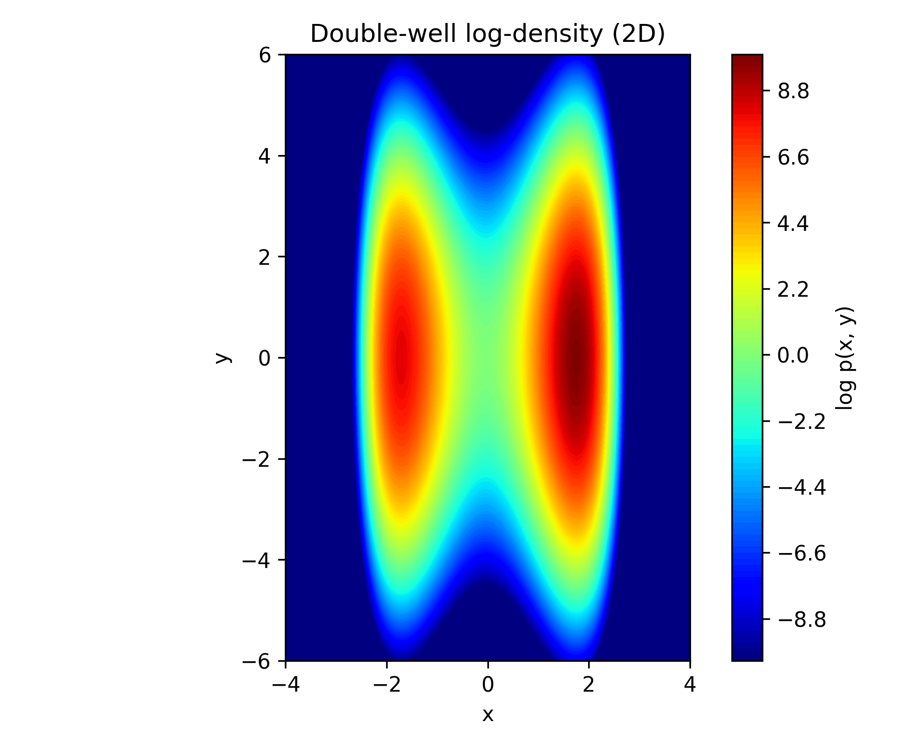

# DoubleWell

A D-dimensional multimodal distribution built from independent 2D double-well pairs, useful for testing samplers that must mix across exponentially many modes.

## Mathematical definition

The D coordinates are grouped into D/2 independent pairs $(x_{2i}, x_{2i+1})$.
Each pair shares the same unnormalized 2D density:

$$
\mu(x, y) = \exp(-x^4 + 6x^2 + 0.5x - 0.5y^2)
$$

The full log-density is the sum over pairs:

$$
\log p(x) = \sum_{i=0}^{D/2-1} \left[-x_{2i}^4 + 6 x_{2i}^2 + 0.5 x_{2i} - 0.5 x_{2i+1}^2\right]
$$



## Why it's hard

The quartic $-x^4 + 6x^2$ creates two modes in each x-coordinate, while the y-coordinate is Gaussian.
With D/2 independent pairs, the full distribution has $2^{D/2}$ modes.
Samplers must visit all of them to mix properly, which becomes exponentially harder as D grows.

## Parameters

| Parameter | Default | Description |
|-----------|---------|-------------|
| `n_dims` | `2` | Number of dimensions (must be even, >= 2). |

## Usage

```python
from jax_pdf import DoubleWell
import jax

dw = DoubleWell(n_dims=10)

# Log-density (unnormalized)
x = jax.numpy.zeros(10)
log_p = dw(x)

# Gradient
grad = jax.grad(dw)(x)

# Batch evaluation
xs = jax.numpy.zeros((50, 10))
log_ps = dw(xs)  # shape (50,)
```

Varying difficulty:

```python
easy = DoubleWell(n_dims=2)    # 2 modes
hard = DoubleWell(n_dims=20)   # 1024 modes
```

## Log normalizing constant

The normalizing constant is available because the density factorizes into D/2 independent pairs.
Each pair has $Z_{\text{pair}} = Z_x \cdot Z_y$ where $Z_y = \sqrt{2\pi}$ is exact and $Z_x = \int \exp(-x^4 + 6x^2 + 0.5x) dx$ is computed via 1D numerical quadrature to machine precision.

```python
dw = DoubleWell(n_dims=10)
log_Z = dw.log_normalization()  # 5 * (log(Z_x) + 0.5 * log(2*pi))
```

## Sampling

Approximate sampling is available via `sample(key, n)`.
Even coordinates are drawn from the 1D double-well marginal using `jax.random.choice` on a precomputed grid of 1M points.
Odd coordinates are standard normal.

```python
key = jax.random.PRNGKey(0)
samples = dw.sample(key, 1000)  # shape (1000, n_dims)
```
